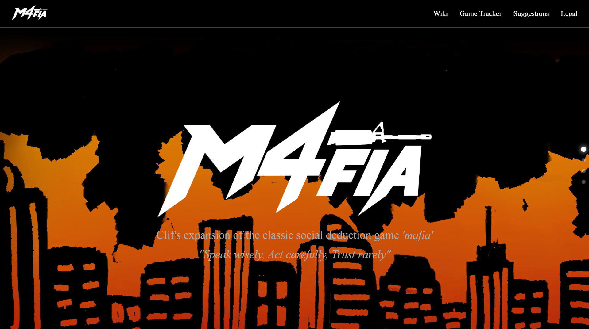
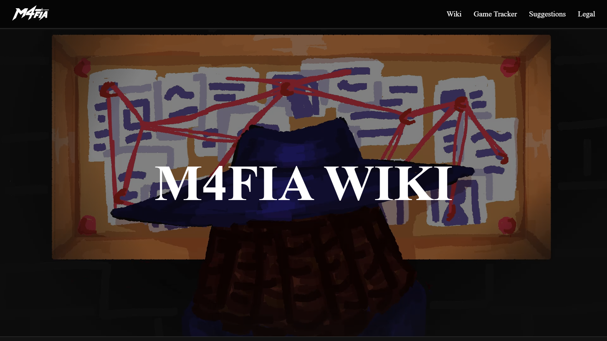
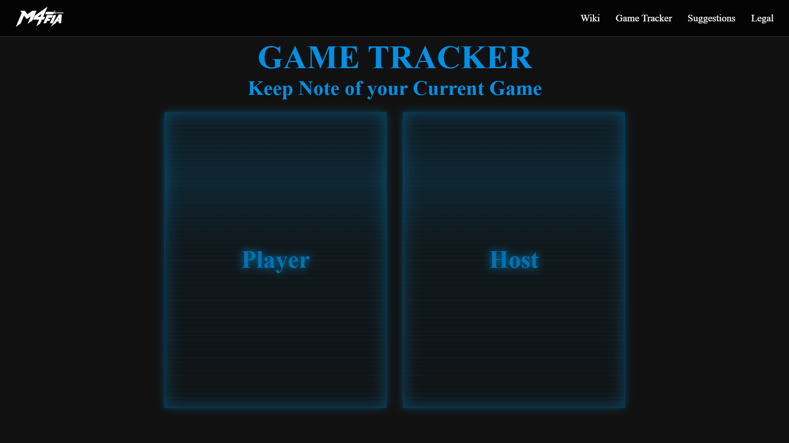
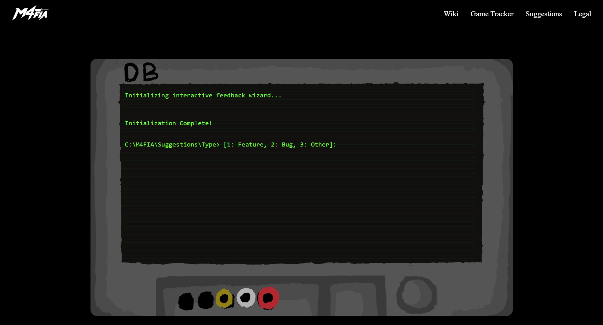

# M4FIA WEBSITE
**Owned by Clifford Luke**

### WHAT IS M4FIA?
It is a Mafia inspired game, containing similar mechanics (when it comes to gameplay), but entirely custom-made roles, factions, and even lore. It's a game that you can host both online and in-person using the official M4FIA Website.

### WHY DID I MAKE THIS?
*"Because it's cool."*
We made this website to make M4FIA make learning, running, and playing it easier (hopefully). And it would be cool and neat to have a dedicated site for the rules, role cards, abilities, and other information, so players can find what they need without having to ask me (Clif) every time.

### HOW TO USE THE WEBSITE
1. Go to https://cliffordluke.github.io/M4fia/.
2. Feel free to browse through the website to get familiar with the game, its lore, rules, and custom roles.
3. Once you feel you are ready to host a game, use the "M4FIA Tracker" found on the website.
4. Don't be afraid to suggest new rules, roles, or even additions to the website in the "Suggestions" page!

**No need to set up anything on your local desktop; everything you need to run a M4FIA game can be found on the website.**

### ACKNOWLEDGEMENTS
- **Clifford Luke**, the primary owner of M4FIA as a whole, spearheading and managing the website's design and functionality
- **Jhazmine Audrey**, a programmer for the M4FIA website, assisted in Github management
- **Timothy Mcquin**, a programmer for the suggestions page of the M4FIA website
- **Jean Raphael**, the sole artist for various M4FIA website art

### SCREENSHOTS:

